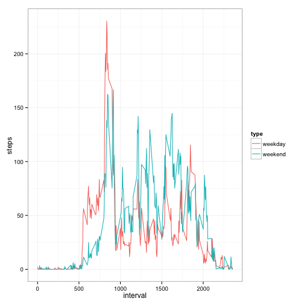

# Reproducible Research: Peer Assessment 1
================================================================================


This document was created Tue Jul 15 09:35:49 2014.

This assignment makes use of data from a personal activity monitoring device. This device collects data at 5 minute intervals through out the day. The data consists of two months of data from an anonymous individual collected during the months of October and November, 2012 and includes the number of steps taken in 5 minute intervals each day.

The data and Rmd markdown template were obtained by Forking and Cloning the GitHub repository https://github.com/rdpeng/RepData_PeerAssessment1, SHA-1 dc20c7c4e92aea6af318a611e2669d5b9c6cbfaf from February 11, 2014.

## Loading and preprocessing the data

```r
#setwd("~/Desktop/RepData_PeerAssessment1")
#files <- list.files()
#files

## read and summarize the activity monitoring data
act1 <- read.csv(file = "activity.csv", header = TRUE)
str(act1)
```

```
## 'data.frame':	17568 obs. of  3 variables:
##  $ steps   : int  NA NA NA NA NA NA NA NA NA NA ...
##  $ date    : Factor w/ 61 levels "2012-10-01","2012-10-02",..: 1 1 1 1 1 1 1 1 1 1 ...
##  $ interval: int  0 5 10 15 20 25 30 35 40 45 ...
```

```r
summary(act1)
```

```
##      steps               date          interval   
##  Min.   :  0.0   2012-10-01:  288   Min.   :   0  
##  1st Qu.:  0.0   2012-10-02:  288   1st Qu.: 589  
##  Median :  0.0   2012-10-03:  288   Median :1178  
##  Mean   : 37.4   2012-10-04:  288   Mean   :1178  
##  3rd Qu.: 12.0   2012-10-05:  288   3rd Qu.:1766  
##  Max.   :806.0   2012-10-06:  288   Max.   :2355  
##  NA's   :2304    (Other)   :15840
```

## What is mean total number of steps taken per day?
1. Make a histogram of the total number of steps taken each day

There is some ambiguity in the instructions as to whether day is referring to days of the week or date.  Let's assume the calendar date, because the instructions refer to weekdays later.


```r
# split on date
split1 <- split(act1$steps, act1$date)
totstepsday <- sapply(split1, sum)
hist(totstepsday, main = "Daily Total Steps")
```

 

```r
#barplot(totstepsday, xlab = "date", ylab = "total steps", main = "Total Steps by Date")
```

2. Calculate and report the **mean** and **median** total number of steps taken per day


```r
meantotstepsday <- mean(totstepsday, na.rm = TRUE)
mediantotstepsday <- median(totstepsday, na.rm = TRUE)
```

The mean steps taken per day is 1.0766 &times; 10<sup>4</sup> and the the median is 10765.

## What is the average daily activity pattern?

1. Make a time series plot (i.e. `type = "l"`) of the 5-minute interval (x-axis) and the average number of steps taken, averaged across all days (y-axis)

2. Which 5-minute interval, on average across all the days in the dataset, contains the maximum number of steps?


```r
library(reshape2)
melt1 <- melt(act1, id = c("date", "interval"), variable = "steps")
# calculate the mean steps for each interval
means1 <- dcast(melt1, interval ~ steps, fun = mean, na.rm = TRUE)
plot(x = means1$interval, y = means1$steps, type = "l", xlab = "interval", 
     ylab = "mean steps", main = "Mean Steps by Interval")
```

 

2. Which 5-minute interval, on average across all the days in the dataset, contains the maximum number of steps?


```r
maxsteps <- max(means1$steps)
maxinterval <- means1[means1$steps == maxsteps, ]
maxinterval
```

```
##     interval steps
## 104      835 206.2
```

The maximum steps for a five minute interval is 206.1698 and is in interval 835.

## Imputing missing values
Note that there are a number of days/intervals where there are missing values (coded as `NA`). The presence of missing days may introduce bias into some calculations or summaries of the data.

1. Calculate and report the total number of missing values in the dataset (i.e. the total number of rows with `NA`s)


```r
numna <- sum(is.na(act1$steps))
```

The number of missing values in the dataset is 2304.

2. Devise a strategy for filling in all of the missing values in the dataset. The strategy does not need to be sophisticated. For example, you could use the mean/median for that day, or the mean for that 5-minute interval, etc.

3.  Create a new dataset that is equal to the original dataset but with the missing data filled in.

Replace NA values in steps with mean values for each time interval.

```r
act2 <- act1
# how many missing values
missing <- is.na(act2$steps)
# fill missing values with mean steps for each interval
act2[missing,"steps"] <- means1$steps
```

4. Make a histogram of the total number of steps taken each day and Calculate and report the mean and median total number of steps taken per day. Do these values differ from the estimates from the first part of the assignment? What is the impact of imputing missing data on the estimates of the total daily number of steps?


```r
split2 <- split(act2$steps, act2$date)
totstepsday2 <- sapply(split2, sum)
hist(totstepsday2, main = "Daily Total Steps")
```

 

```r
#barplot(totstepsday2, xlab = "date", ylab = "total steps", main = "Total Steps by Date")
meantotstepsday2 <- mean(totstepsday2, na.rm = TRUE)
mediantotstepsday2 <- median(totstepsday2, na.rm = TRUE)
# make a nice table
t <- data.frame(row.names = c("Mean", "Median"))
t[1, 1] <- meantotstepsday
t[1, 2] <- meantotstepsday2
t[2, 1] <- mediantotstepsday
t[2, 2] <- mediantotstepsday2
names(t) = c("Original","Imputed" )
t
```

```
##        Original Imputed
## Mean      10766   10766
## Median    10765   10766
```

The missing values for steps for 8 days were replaced with the 288 mean interval values.  This has an impact on total steps for the entire dataset as can be seen in the histogram and barplots, but no difference in the mean total steps per day.  The median total steps per day is different by 1 step.

## Are there differences in activity patterns between weekdays and weekends?

1. Create a new factor variable in the dataset with two levels – “weekday” and “weekend” indicating whether a given date is a weekday or weekend day.


```r
dayofweek <- weekdays(as.Date(act2$date))
act3 <- cbind(act2, dayofweek)
act3[act3$dayofweek == "Monday", 5] <- "weekday"
act3[act3$dayofweek == "Tuesday", 5] <- "weekday"
act3[act3$dayofweek == "Wednesday", 5] <- "weekday"
act3[act3$dayofweek == "Thursday", 5] <- "weekday"
act3[act3$dayofweek == "Friday", 5] <- "weekday"
act3[act3$dayofweek == "Saturday", 5] <- "weekend"
act3[act3$dayofweek == "Sunday", 5] <- "weekend"
names(act3)[5] <- "type"
# check
table(act3$dayofweek)
```

```
## 
##    Friday    Monday  Saturday    Sunday  Thursday   Tuesday Wednesday 
##      2592      2592      2304      2304      2592      2592      2592
```

```r
table(act3$type)
```

```
## 
## weekday weekend 
##   12960    4608
```

2. Make a panel plot containing a time series plot (i.e. type = "l") of the 5-minute interval (x-axis) and the average number of steps taken, averaged across all weekday days or weekend days (y-axis). 

Two plots are provided below.  The first shows mean steps per interval in one panel color coded on weekend/weekday.  This plot allows easy comparison of the weekend to weekday and that the subject gets started later in the day on weekends.  The second plot is the two panel plot requested in the instructions for this assignment.


```r
melt3 <- melt(act3, id = c("date", "dayofweek", "type", "interval"), variable = "steps")
# calculate the mean steps for each interval by type
means3 <- dcast(melt3, interval + type ~ steps, fun = mean, na.rm = TRUE)
library(ggplot2)
ggplot(means3, aes(interval, steps, col = type)) + 
    geom_line() +
    theme_bw()
```

 

```r
#ggplot(means3, aes(interval, steps)) +
#    geom_line() +
#    facet_wrap(~type, ncol = 1) +
#    theme_bw()
library(lattice)
xyplot(steps ~ interval | type, data = means3, type = "l", layout = c(1,2))
```

 

